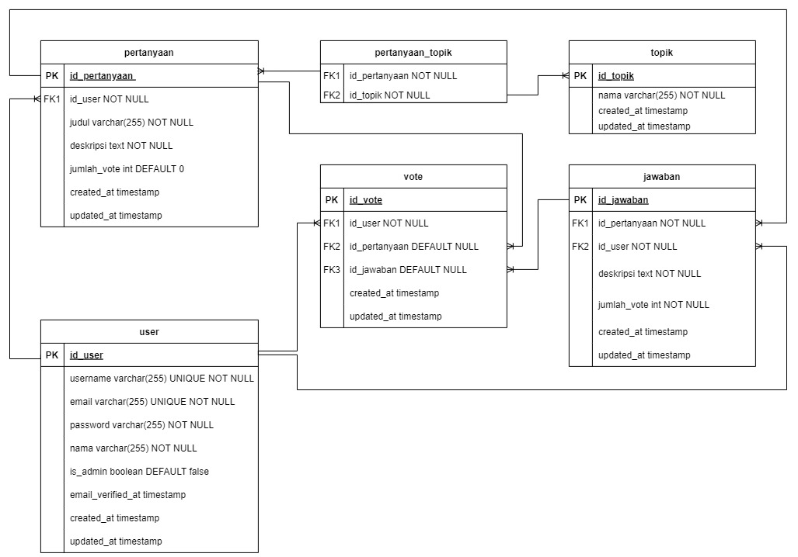

# Introduction

Sebuah forum diskusi di mana mahasiswa dapat membuat unggahan pertanyaan dan bisa dibalas oleh mahasiswa lain.

## MVP

- User baru dapat melakukan pendaftaran akun yang terhubung ke sistem
- User dapat melakukan proses autentikasi untuk masuk ke dalam sistem
- User dapat melakukan reset password dari akun user
- User dapat melihat profil user lain
- User dapat melihat profil ketika terautentikasi
- User dapat melihat pertanyaan di halaman utama website
- User dapat membuat pertanyaan di website 
- User dapat mengubah properti yang dimiliki suatu pertanyaan (judul, topik, dan deskripsi)
- User dapat menghapus pertanyaan yang telah dibuat
- User dapat memberikan jawaban pada pertanyaan 
- User dapat memberikan vote pada pertanyaan 
- User dapat memberikan vote pada jawaban 
- User dapat mencari pertanyaan yang ada pada website 
- User dapat melakukan sortir pencarian berdasarkan topik 
- User dapat melakukan sortir pencarian berdasarkan waktu unggah dan jumlah vote
- Admin dapat melakukan proses autentikasi untuk masuk ke dalam sistem 
- Admin dapat melihat daftar user yang ada di dalam sistem
- Admin dapat mengubah data user yang terdapat di dalam sistem (username, nama, email, role admin)
- Admin dapat menghapus user yang terdapat di dalam sistem 
- Admin dapat menghapus pertanyaan yang telah dibuat user 
- Admin dapat menghapus komentar yang diberikan dari user

## Service Implementation

```plain
GIVEN => User ingin melakukan autentikasi untuk masuk ke dalam sistem
WHEN => User memasukkan username dan password pada form autentikasi dan menekan tombol "Masuk"
THEN => Sistem akan memvalidasi informasi yang diberikan, mengarahkan user ke halaman utama, dan memberikan notifikasi bahwa autentikasi berhasil dilakukan.

GIVEN => User ingin melakukan reset password dari akun
WHEN => User mengklik link "Lupa Password" pada halaman autentikasi dan mengikuti langkah-langkah yang diberikan
THEN => Sistem akan memvalidasi informasi yang diberikan, mengirimkan email yang berisi link untuk reset password, dan memberikan notifikasi bahwa email telah dikirim.

GIVEN => User ingin melihat profil user lain dan riwayat pertanyaan yang sudah dibuat
WHEN => User mengklik tombol username user lain
THEN => Sistem akan menampilkan data user lain dan daftar pertanyaan yang telah dibuat oleh user tersebut dengan informasi seperti judul, topik, jumlah jawaban, dan jumlah vote dengan urutan terbaru.

GIVEN => User ingin melihat profil sendiri dan riwayat pertanyaan yang sudah dibuat
WHEN => User mengklik tombol profil
THEN => Sistem akan menampilkan data user dan daftar pertanyaan yang telah dibuat oleh user dengan informasi seperti judul, topik, jumlah jawaban, dan jumlah vote dengan urutan terbaru.

GIVEN => User ingin melihat pertanyaan di website
WHEN => User membuka halaman pertanyaan
THEN => Sistem akan menampilkan daftar pertanyaan yang telah dibuat oleh pengguna lain, beserta informasi seperti judul, topik, deskripsi, jumlah jawaban, dan jumlah vote dengan urutan terbaru.

GIVEN => User ingin membuat pertanyaan di website dan telah melakukan log-in 
WHEN => User mengklik tombol "Buat Pertanyaan" pada halaman pertanyaan dan mengisi form yang diberikan
THEN => Sistem akan memvalidasi informasi yang diberikan, membuat pertanyaan baru untuk user, dan mengarahkan user ke halaman pertanyaan.

GIVEN => User ingin mengubah properti yang dimiliki suatu pertanyaan (judul, topik, deskripsi) dan telah melakukan log-in
WHEN => User mengklik tombol "Ubah" pada halaman pertanyaan yang ingin diubah dan mengisi form yang diberikan
THEN => Sistem akan memvalidasi informasi yang diberikan, mengubah properti dari pertanyaan milik user yang dimaksud, dan mengarahkan user ke halaman pertanyaan.

GIVEN => User ingin menghapus pertanyaan yang telah dibuat dan telah melakukan log-in
WHEN => User mengklik tombol "Hapus" pada halaman pertanyaan yang ingin dihapus
THEN => Sistem akan memvalidasi bahwa user memiliki hak untuk menghapus pertanyaan tersebut, menghapus pertanyaan dari sistem, dan mengarahkan user ke halaman pertanyaan.

GIVEN => User ingin memberikan jawaban pada pertanyaan
WHEN => User mengisi form jawaban yang tersedia pada halaman pertanyaan
THEN => Sistem akan memvalidasi informasi yang diberikan, menambahkan jawaban baru ke pertanyaan, dan mengarahkan user ke halaman pertanyaan yang telah diberi jawaban baru.

GIVEN => User ingin memberikan vote pada pertanyaan
WHEN => User mengklik tombol "Vote" pada halaman pertanyaan
THEN => Sistem akan memvalidasi informasi yang diberikan, menambahkan vote baru pada pertanyaan, dan mengarahkan user ke halaman pertanyaan yang telah diberi vote baru.

GIVEN => User ingin memberikan vote pada jawaban
WHEN => User mengklik tombol "Vote" pada jawaban yang ada pada halaman pertanyaan
THEN => Sistem akan memvalidasi informasi yang diberikan, menambahkan vote baru pada jawaban, dan mengarahkan user ke halaman pertanyaan yang telah diberi vote baru.

GIVEN => User ingin mencari pertanyaan yang telah terbuat
WHEN => User memasukkan kata kunci pada kolom pencarian pada halaman pertanyaan dan menekan tombol "Cari"
THEN => Sistem akan mencari pertanyaan yang sesuai dengan kata kunci yang diberikan oleh user dan menampilkan hasil pencarian pada halaman pertanyaan.

GIVEN => User ingin melakukan pencarian berdasarkan topik
WHEN => User memilih topik yang diinginkan pada daftar topik yang tersedia pada halaman pertanyaan dan menekan tombol "Cari"
THEN => Sistem akan menampilkan daftar pertanyaan yang sesuai dengan topik yang dipilih oleh user pada halaman pertanyaan.

GIVEN => User ingin melakukan sortir pencarian berdasarkan waktu unggah dan jumlah vote
WHEN => User memilih opsi sortir pada halaman pencarian dan menekan tombol "Cari"
THEN => Sistem akan menampilkan daftar pertanyaan yang diurutkan berdasarkan kriteria yang dipilih oleh user, seperti waktu unggah dan jumlah vote.

GIVEN => Admin ingin melakukan autentikasi untuk masuk ke dalam sistem
WHEN => Admin memasukkan username dan password pada form autentikasi khusus admin dan menekan tombol "Masuk"
THEN => Sistem akan memvalidasi informasi yang diberikan, mengarahkan admin ke halaman dashboard admin, dan memberikan notifikasi bahwa autentikasi berhasil dilakukan.

GIVEN => Admin ingin melihat daftar user untuk diubah atau dihapus
WHEN => Admin mengklik tombol "manage user"
THEN => Sistem mengarahkan ke halaman "manage user" dan menampilkan daftar user.

GIVEN => Admin ingin mengubah data yang dimiliki satu user (username, nama, email, role admin)
WHEN => Admin mengklik tombol "Ubah" pada user yang ingin diubah dan mengisi form yang diberikan
THEN => Sistem akan memvalidasi informasi yang diberikan, mengubah data dari user yang dimaksud, dan mengarahkan admin ke halaman manage user.

GIVEN => Admin ingin menghapus user yang terdapat di dalam sistem
WHEN => Admin memilih opsi "Hapus" pada halaman daftar user dan menekan tombol "Konfirmasi"
THEN => Sistem akan memvalidasi bahwa admin memiliki hak untuk menghapus user tersebut, menghapus user dari sistem, dan mengarahkan admin ke halaman daftar user yang telah diperbarui.

GIVEN => Admin ingin menghapus pertanyaan yang telah dibuat user
WHEN => Admin memilih opsi "Hapus" pada halaman pertanyaan yang ingin dihapus dan menekan tombol "Konfirmasi"
THEN => Sistem akan memvalidasi bahwa admin memiliki hak untuk menghapus pertanyaan tersebut, menghapus pertanyaan dari sistem, dan mengarahkan admin ke halaman pertanyaan yang masih tersedia.

GIVEN => Admin ingin menghapus komentar yang diberikan dari user
WHEN => Admin memilih opsi "Hapus" pada halaman komentar yang ingin dihapus dan menekan tombol "Konfirmasi"
THEN => Sistem akan memvalidasi bahwa admin memiliki hak untuk menghapus komentar tersebut, menghapus komentar dari sistem, dan mengarahkan admin ke halaman pertanyaan yang berkaitan dengan komentar yang dihapus.
```

## Entity Relationship Diagram


